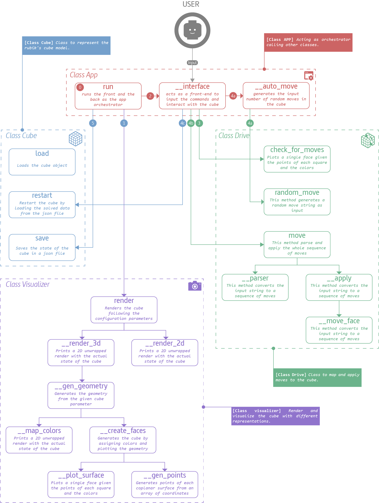

# Rubiks Cube Project

## Object-oriented programming model

I started by developing a centric architecture pattern with an orchestrator class. Then I added a class to generate the mapped cube as a data frame and a 2D visualizer with the unwrapped cube to render the work in progress. Finally, I developed a "Drive" class to apply permutations in the cube.

Although it was not enough with a 2D unwrapped model, I started thinking about a 3D render engine using the Matplotlib library. I choose this library for its ease of use. It was hard to figure out how to update the model in real-time but way worth it.

<br>
To develop the model, I defined these four Python classes:
1. **Class App:** This class initiates the whole program and acts as an orchestrator calling other classes
2. **Class Cube:** This class represents the Rubik's cube model as a Dataframe.
3. **Class Drive:** This class maps the permutations and applies moves to the cube.
4. **Class Viz:** This class generates 2D and 3D models and renders each representation.

As a graphic support I drew a pattern with the classes, their methods and the calls between the different components in the infographic below.




## Cube notation model

Before developing the code, I needed to define how to represent and serialize the data. It was so fun to notate and map the cube.

### Naming convention
First, I established a naming convention naming each face by color. I used the same color scheme I have at my physical Rubik's cube, the BOY scheme (blue-orange-yellow).

- **W** -> white
- **G** -> green
- **O** -> Orange
- **B** -> Blue
- **R** -> Red
- **Y** -> Yellow

### Faces notation
I am used to solving my Rubik's cube starting on the white face. Therefore, I decided to take this face as the main reference, becoming the front and the center face when unwrapping the cube.

```
	| R |
| B | W | G | Y |
	| O |
```

### Faces parametrization
Once I assigned the colors to the faces, I named each face square by the initial of its color and the position occupied in the matrix. After this step, I had my model parametrized and ready to roll.

```
         |R1|R2|R3|
         |R4|R5|R6|
         |R7|R8|R9|
|B1|B2|B3|W1|W2|W3|G1|G2|G3|Y1|Y2|Y3|
|B4|B5|B6|W4|W5|W6|G4|G5|G6|Y4|Y5|Y6|
|B7|B8|B9|W7|W8|W9|G7|G8|G9|Y7|Y8|Y9|
         |O1|O2|O3|
         |O4|O5|O6|
         |O7|O8|O9|
```

### Serialization structure
Last but not least, it was necessary to save the state of the data. To accomplish this, I used a JSON format structure defining keys by their face color and the list of squares of each face as values.

```
{
  "w": ["w1", "w2", "w3", "w4", "w5", "w6", "w7", "w8", "w9"],
  "r": ["r1", "r2", "r3", "r4", "r5", "r6", "r7", "r8", "r9"],
  "g": ["g1", "g2", "g3", "g4", "g5", "g6", "g7", "g8", "g9"],
  "o": ["o1", "o2", "o3", "o4", "o5", "o6", "o7", "o8", "o9"],
  "b": ["b1", "b2", "b3", "b4", "b5", "b6", "b7", "b8", "b9"],
  "y": ["y1", "y2", "y3", "y4", "y5", "y6", "y7", "y8", "y9"]
}
```

</br>
### Moves notation
I used the [Singmaster notation](https://en.wikipedia.org/wiki/Rubik%27s_Cube#Move_notation) developed by [David Singmaster](https://en.wikipedia.org/wiki/David_Singmaster). Its relative nature allows algorithms to be written in such a way that they can be applied regardless of which side is designated the top or how the colors are organized on a particular cube.

- **t:** Top side move 1 clockwise
- **f:** Front side move 1 clockwise
- **d:** Down side move 1 clockwise
- **r:** Right side move 1 clockwise
- **l:** Left side move 1 clockwise
- **b:** Back side move 1 clockwise

So for example we could apply a combined premutation by doing:
```
t2l3b1r2
```
- **t2:** Top side move 2 clockwise
- **l3:** Left side move 3 clockwise (same as left side move 1 anticlockwise)
- **b1:** Back side move 1 clockwise
- **r2:** Right side move 2 clockwise